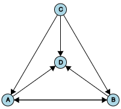

# Graph Theory

Create and visualize directed or undirected graphs in the browser : [playground demo](https://nathsou.github.io/GraphTheory/playground/index.html)

## Documentation

Access the online [documentation](https://nathsou.github.io/GraphTheory/docs/index.html)